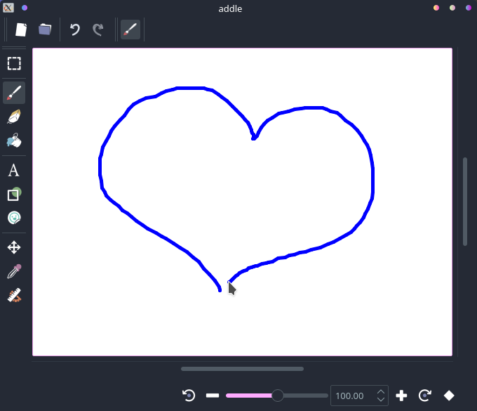

# Addle

Addle is a lightweight graphical application for drawing, editing and viewing images, as well as various other image-related tasks. It is written in C++ with Qt.

**This project is currently very early in development.** Its design, features, and support will be subject to adjustment and many things may change considerably between now and release.

## Features


> Demo of Addle's GUI, (on KDE Plasma, using the Breeze style)

Addle is a work-in-progress dual-purpose image viewer and image editor, providing a modest set of features to both ends. This includes that (at release) Addle should load quickly and maintain a conservative memory footprint to perform well as an image viewer.

The editing mode will be streamlined for common and simple image editing tasks, such as resizing and cropping, basic drawing / annotating, basic filters, and I/O via the clipboard. Addle is meant to be intuitive and convenient, and not necessarily advanced or "powerful". 

Raster drawing tools will include multiple basic paintbrushes and erasers, as well as a fill bucket. Vector drawing tools will include shapes, text entry, and "stickers" (i.e., reusable image assets). Filters will include such things as HLS adjust, gaussian blur, and so on. Multi-layer images and transparency are supported.

Both editing and viewing modes will use a freely panning/zooming/rotating viewport, and both will have a selection tool for copying image data to the clipboard.

Addle's viewing mode will display short looping animations (e.g., GIF). At some point, the editing mode may be extended to also support animation: this is a desired feature, but not a prioritized one.

A few other I/O features are intended or under consideration, including screen capture and capture from a web browser. 

Addle's features will also eventually be extensible via plugins, using a Python API.

## Platforms

Support is currently prioritized for desktop Linux and Windows.

Hopefully, in the future support can be extended to OS X and other platforms that support Qt. A mobile-optimized UI, with support for Android, iOS, and other mobile operating systems is also on the table, but will be a low priority for the time being. A version of Addle for web (via wasm) is also on the table but low priority. Addle being lightweight, some degree of support may be extended to embedded or legacy systems (insofar as such support might be useful).

Currently, as this project is still pre-Alpha, no installers or binaries are available for download.

## Building

Dependencies:

- One of the following compilers (using standard C++11):
  - GCC (10.1.0 is a known working version)
  - MSVC (Visual Studio 2017 is a known working version)
  - Clang is not officially supported (yet) but 10.0.1 is known to work on Linux
- CMake 3.4 or later
- Qt 5.15
- Boost headers (1.72 is a known working version)
- (optional) MinGW-w64

More dependencies (and more specific versioning requirements) are likely in the future.

The procedure for building Addle is typical of CMake/Qt5 projects.

In brief, **on Linux** create and enter a directory "build" under the source code directory and run the following:
```sh
cmake ..
make
```

**On Windows**, open the source code directory in Visual Studio as a CMake project.

For more detailed instructions, see [Building](./docs/Building.md).

## Contribution

The official repository is on GitHub at https://github.com/squeevee/Addle

Be advised that as Addle is still pre-Alpha, the code base may be subject to disruptive refactoring (though we should be through the worst of it by now).

See [Overview](./docs/Overview.md) for some high-level overviews of Addle's code.

## License

The source code for Addle is available under the terms of the MIT license.